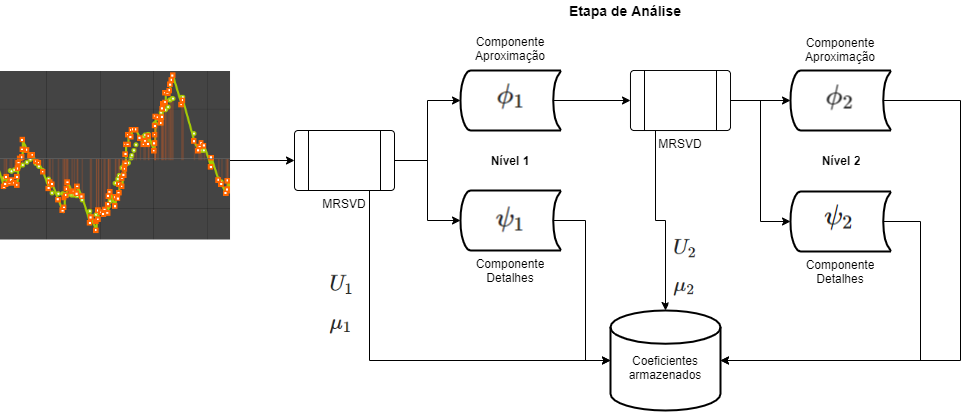

# Decomposição em Valores Singulares em Multirresolução (MRSVD - Multiresolution Singular Value Decomposition)

<u>Método proposto por Kakarala e Ogunbona (2001):</u> Signal analysis using a multiresolution form of the singular value decomposition. IEEE Transactions on Image processing, 10(5), 724-735.

Vídeo-tutorial disponível no Youtube: https://youtu.be/eYDv9lHlMk8
